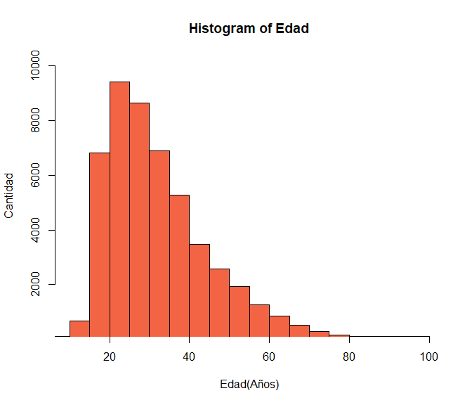
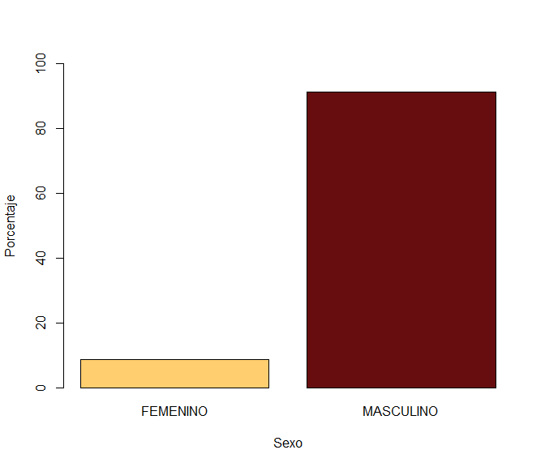
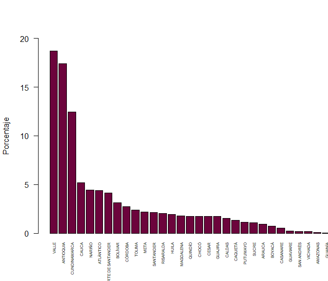
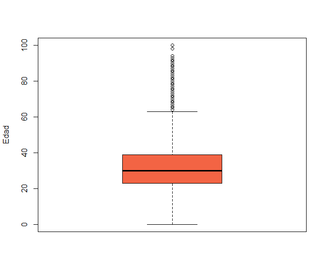
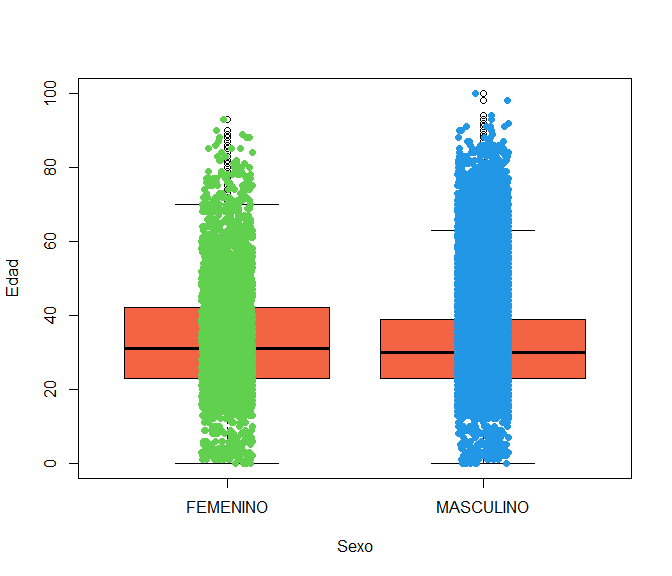
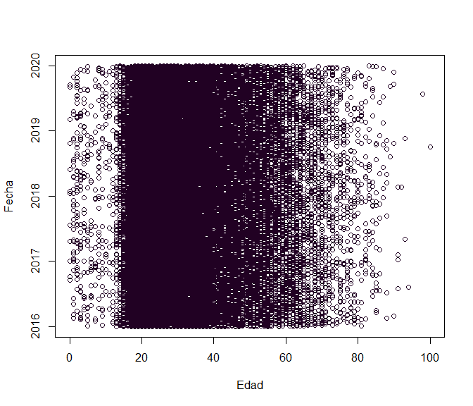
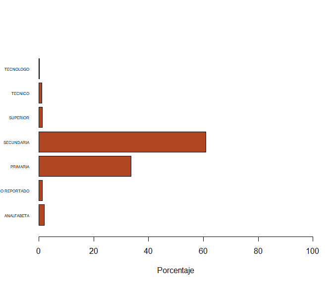

# Introduccion

Como problema de clase se realizara el análisis de las víctimas de homicidios en Colombia, es crucial para comprender y abordar la complejidad de este fenómeno. Este país ha enfrentado desafíos significativos en términos de seguridad y violencia, lo que subraya la importancia de examinar detenidamente las características, tendencias y factores asociados con estas tragedias. Este estudio se enfocará en proporcionar una visión detallada y analítica de las víctimas de homicidios en Colombia, con el propósito de informar a la sociedad.


```
{r cols.print=10, rows.print=3}
mtcars
```
A continuacion presentaremos un histograma sobre la edad de las victimas de homicidios.

```r
hist(Edad, col="#f36444", xlim=c(10,100),ylim=c(500,10000),xlab="Edad(Años)",ylab="Cantidad")
```

<!-- -->

Nos encontramos que el pico de los datos ocurre entorno a los 25 a 30 años de edad de la victima.


Ahora encontraras los indicadores de tendencia central, posicion y forma.

Media: La media representa el punto de equilibrio de la distribución.

```r
####MEDIA VARIABLE CUANTITATIVA
Edad_NA<-as.numeric(na.omit(Datos1$Edad))
media <- round(mean(Edad_NA, na.rm = TRUE),2)
paste("La media de los datos =", media)
```

```
## [1] "La media de los datos = 32.6"
```
Mediana: <br> 
Número intermedio de un grupo de números, en este caso 30 que es la tendencia de la edad de la mayoria de las victimas

```r
####MEDIANA VARIABLE CUANTITATIVA
mediana <- median(Edad_NA, na.rm=TRUE)
print(mediana)
```

```
## [1] 30
```
Asimetria: <br>
El resultad positivo de este indicador significa que la distribución se encuentra sesgada hacia la izquierda o sea que cuenta con una orientación positiva

```r
####ASIMETRIA VARIABLE CUANTITATIVA
asimetria_EDAD<-skewness(Edad_NA, na.rm = TRUE)
asimetria_EDAD
```

```
## [1] 1.027472
```
Curtosis: <br>
Nos indica que la distribución de los datos es muy leptocúrtica. Esto significa que tiene picos muy pronunciados en el centro y colas muy largas en comparación con una distribución normal.

```r
# Curtosis
curtosis_EDAD<-kurtosis(Edad_NA, na.rm = TRUE)
curtosis_EDAD
```

```
## [1] 4.089808
```

Niveles de Confianza: <br>
El intervalo de confianza para la edad de los casos de asesinatos en Colombia se estima entre 32.48539 y 32.71493 con un nivel de confianza del 95%.El nivel de confianza del 95% indica que si repitiéramos el proceso de muestreo y construcción del intervalo de confianza muchas veces, aproximadamente el 95% de esos intervalos contendrían la verdadera edad promedio de la población.


```r
intervalo_Edad<-t.test(Edad_NA)$conf.int
intervalo_Edad
```

```
## [1] 32.48539 32.71493
## attr(,"conf.level")
## [1] 0.95
```

# Comparacion de victimas por sexo

De todos estos homicidios decidimos analizar la diferencia entre los géneros de las víctimas. Encontramos que el 91.37% del total de las víctimas son hombres, mientras que el 8.62% corresponden a mujeres.


```r
porcentaje_sexo<-100*prop.table(table(Datos1$Sexo))
barplot(porcentaje_sexo,col = c("#ffce6f","#670d0f"), ylim=c(0,100), xlab="Sexo", ylab="Porcentaje") 
```

<!-- -->

```r
summary(porcentaje_sexo)
```

```
## Number of cases in table: 100 
## Number of factors: 1
```

# Distribucion de Homicidios por Departamento


```r
porcentaje <- prop.table(table(Datos1$Departamento))
porcentaje <- porcentaje[order(-porcentaje)]
porcentaje<-porcentaje*100

barplot(porcentaje,col= c ("#6c043c"),xlim=c(0,33),ylim=c(0,20),xlab=" ", ylab="Porcentaje", las=2, cex.names = 0.5) 
```

<!-- -->

```r
#revisar valores exactos y cambiarlos en la leyenda
```
Entre los departamentos analizados, Valle se destacó como el de mayor número de homicidios, totalizando con %18.69 , seguido por Antioquia y Cundinamarca, teniendo en cuenta que son los departamentos mas poblados del pais. Por otro lado, Vaupés presentó la menor incidencia con %0.02, seguido de cerca por Guainia.

# Análisis de Edades: Tendencias y Valores Atípicos


```r
boxplot(Edad, ylab = "Edad", col= "#f36444")
```

<!-- -->

```r
#revisar valores exactos y cambiarlos en la leyenda
```
Comparando la mediana, notamos que el 50% de las víctimas tenían 30 años. Un cuarto de ellas eran menores de 23 años, mientras que detectamos múltiples valores inusuales, los cuales se interpretan como puntos fuera del límite superior, excediendo los 60 años, teniendo datos atipicos que rondan hasta los 90 o 100 años de edad

```r
#### CUARTILES VARIABLE CUNTITATIVA
quartileEdad<-quantile(Edad_NA, na.rm = TRUE)
quartileEdad
```

```
##   0%  25%  50%  75% 100% 
##    0   23   30   39  100
```
Cuartiles
La funcion de los cuartiles es informar del valor de la variable que ocupara la posicion (en tanto por cien) que nos interese respecto de todo el conjunto de variables.


# Análisis de Edades por Sexo: Diagrama de Cajas y Alambres


```r
boxplot(Edad~Sexo, ylab = "Edad", xlab = "Sexo" ,col= "#f36444")
stripchart(Edad~Sexo, vertical = TRUE, method = "jitter", pch = 19, add = TRUE, col = 3:length(levels(chickwts$feed)))
```

<!-- -->

```r
#revisar valores exactos y cambiarlos en la leyenda
```
Comparando las medianas de ambos géneros, se evidencia que el 50% de las muestras, tanto en el grupo masculino como en el femenino, es similar. No obstante, en el grupo femenino, se aprecia que el 75% de las muestras son menores a 40 años, mientras que en el grupo masculino este mismo porcentaje corresponde a menores de 38 años. Respecto a los valores atípicos, se presentan más casos en el grupo masculino que superan los 63 años, mientras que en el grupo femenino se observan casos que superan los 70 años. 

# Relación entre Fecha y Edad: Diagrama de Dispersión

En el presente gráfico de dispersión, se aprecia que a lo largo de los años, la mayoría de las víctimas han permanecido en el rango de edades de 20 a 40 años. No obstante, a pesar del transcurso del tiempo, no se evidencia ni un incremento ni una reducción en los homicidios; la situación se mantiene constante.    

```r
Fecha<-as.Date(Datos1$Fecha)

plot(Edad, Fecha, col = c ("#210123"))
```

<!-- -->

```r
Fecha_freq<-table(Datos1$Fecha)
Edad_freq<-table(Datos1$Edad) 
```
# Análisis de Nivel de Educación de las Víctimas


```r
porcentaje_educacion <- prop.table(table(na.omit(gsub("-", NA, Datos1$Escolaridad)))) 
porcentaje_educacion<- porcentaje_educacion*100 
```

En el grafico anterior podemos ver que el 60% de las víctimas poseían formación de nivel secundario, seguido por un 33.5% que tenía educación primaria. Lo anterior nos puede indicar que existe una relación entre la población victima con la población que no cuenta con estudios técnicos, tecnólogos y/o superiores que son los que presentan el menor porcentaje de victimas, sumando entre estás tres el 2,35% entre todos los casos.

```r
barplot(porcentaje_educacion, col = c ("#b14623"), xlim=c(0,100),ylim=c(0,9),xlab="Porcentaje", ylab=" ", las=1, cex.names = 0.5, horiz = TRUE)
```

<!-- -->

```r
length(Datos1$Escolaridad)
```

```
## [1] 49261
```
Cuartiles:

```r
Escolaridad_NA <- table(na.omit(gsub("-", NA, Datos1$Escolaridad)))
quartiles <- quantile(Escolaridad_NA, na.rm = TRUE)
quartiles
```

```
##      0%     25%     50%     75%    100% 
##    26.0   564.5   591.0  8723.0 29790.0
```
Los intervalos de confianza para las proporciones de nivel de escolaridad de las víctimas son los siguientes: para "ANALFABETA NO REPORTADO", el intervalo va desde aproximadamente 0.5% hasta 0.6%; para "PRIMARIA", se extiende desde alrededor del 1.9% hasta el 2.1%; para "SECUNDARIA", desde aproximadamente 1.1% hasta 1.3%; para "SUPERIOR", abarca desde cerca del 32.9% hasta el 33.8%; para "TECNICO", se encuentra entre alrededor del 60.0% y 60.9%; y finalmente, para "TECNOLOGO", el intervalo va desde aproximadamente 0.01% hasta 0.01%. Estos intervalos proporcionan rangos estimados dentro de los cuales es probable que se encuentre la verdadera proporción de víctimas de asesinatos en cada nivel de escolaridad, con un nivel de confianza del 95%

```r
# Calcular la frecuencia de cada nivel de escolaridad
Escolaridad<-as.character(Datos1$Escolaridad)
frecuencia_niveles <- table(Escolaridad)

# Calcular el intervalo de confianza para la proporción de cada nivel de escolaridad
intervalos_confianza <- sapply(frecuencia_niveles, function(x) {
  prop.test(x, length(Escolaridad))$conf.int
})

intervalos_confianza
```

```
##                - ANALFABETA NO REPORTADO  PRIMARIA SECUNDARIA   SUPERIOR
## [1,] 0.005028907 0.01898329   0.01071268 0.3297941  0.6004024 0.01106348
## [2,] 0.006376783 0.02148921   0.01262814 0.3381436  0.6090572 0.01300807
##         TECNICO    TECNOLOGO
## [1,] 0.01038159 0.0003520007
## [2,] 0.01226909 0.0007853226
```

# Conclusión

El presente estudio analiza los datos de las víctimas de homicidios en Colombia entre los años 2016 y 2019, utilizando el lenguaje de programación R. Los resultados muestran que el número de víctimas de homicidios se ha sostenido en el período estudiado, pero que aún persisten altos niveles de violencia en algunos departamentos, especialmente Antioquia, Valle del Cauca y Cauca. Asimismo, se evidencia que la mayoría de las víctimas son hombres jóvenes y que las principales causas de los homicidios son las riñas, la violencia interpersonal y el conflicto armado. Conclimos en que los homicidios y sus causas en Colombia siguen siendo un problema de seguridad pública que requiere de políticas integrales de prevención y atención. Para ello, se recomienda hacer politicas que promuevan el dialogo entre pueblos, y la cobertura de los datos, fortalecer el sistema de justicia, promover la convivencia pacífica y proteger los derechos humanos en todas las situaciones cotidianas de la población colombiana.
